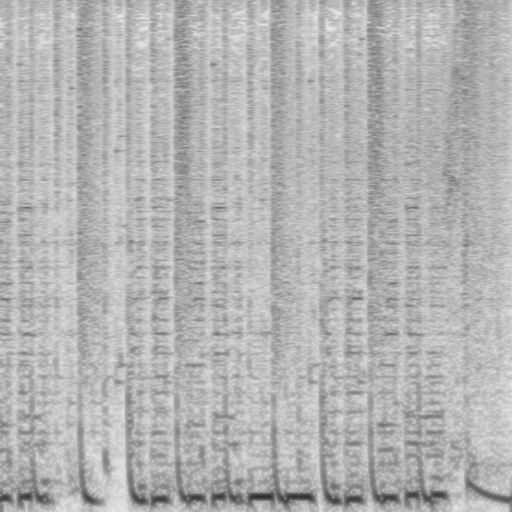
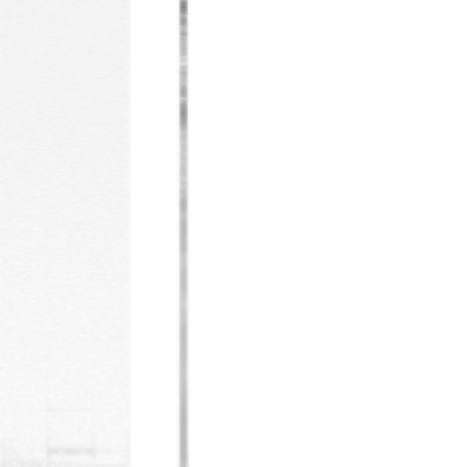

# Riffusion Manipulation Tools

# Usage

## Flags
The following arguments/flags are available on all convertors:

`-i / --input INPUTFILE.ext`

---

On img2audio.py:
`-o / --output OUTPUTFILE.ext`

On file2img.py:
`-o / --output OUTPUT_FOLDER`

---

`-m / --maxvol [integer]` : Maximun volume, 50+ Okay quality, 100+ Good Quality, 255+ Max Quality

`-p / --powerforimage [float]` : Amount of power to use. 0.25-0.35 recommended. Too low will create loud noise, too high will create silent static

`-n / --nmels [integer]` : n_mels to use. Must match the ones on the image. Basically the HEIGHT. 512 is the default used by the webUI, the higher it is the less compression is used and higher quality. Maximun is somewhere 1280.

---

On file2img.py
`-d / --duration` : Duration of each chunk in ms. 1 Second = 1000ms. Determines how wide the image will be. 5119 to get 512 width image.

## Convert Audio to Image
To convert an audio into an image use file2img.py:

`python3 file2img.py -i INPUT_AUDIO.wav -o OUTPUT_FOLDER`

Note that, this will generate a folder with all the output spectogram images, each separated by 5119 ms (5.12 seconds).

For example, to convert charmpoint.mp3 [(Credits: 
Snail's House - Charm Point)](https://www.youtube.com/watch?v=NNvptCE6_Ds)

`python3 file2img.py -i charmpoint.wav -o charmpoint_images`

Will generate a folder with the spectograms of the entire song. Each spectogram correspond to 5119 ms chunks, unless you set the duration flag to one of your choice. Heres one of them:

This image can be used as a seed on the riffusion webUI.

Additionally, if the audio does not end in a multiple of the duration, it will grab the remaining ms and add silence to it:

## Verify / Convert Image to Audio
It is highly recommended to verify that the audio has been correctly converted. You can do soo by using img2audio.py:

`python3 img2audio.py -i INPUT_IMAGE.ext -o OUTPUT_AUDIO.ext`

`python3 img2audio.py -i charmpoint_chunks/charmpoint_43.png -o charmpoint_chunk_43.mp3`

This audio is also included in the repository.

# More info
The result images are in 1 channel, Black and White. In order for these to be accepted by Stable Diffusion tools, you need to convert them into RGB. The Riffusion inference server also does this. Most webUIs do this by default.

# Experiments

Experiments on variables are available at tests/

Currently the only experiment available is one done with [Planet Girl from ALIEN POP](https://youtu.be/EzSC4PFnYLY?t=19) at 0:19, clip.wav being the original audio, and configurations used being available on the folder names.

# Support
If you need help with this tool, join the SAIL discord and go to the #riffuser channel: https://discord.gg/KfjghC3ppS

You can also join the (unofficial) riffuser discord: https://discord.gg/HWdanyzvRt